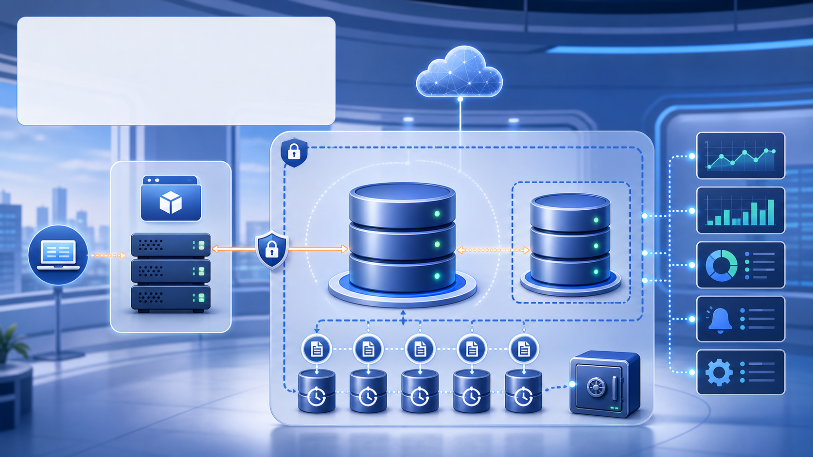

  

    
    
  

  

    <h1 class="title-main">Cloud AWS y despliegues productivos</h1>
    

    
Módulo 3 · Sesión 3

    <strong>Diego Fernando Baes Vasquez</strong>
  

---

  

    
    
  

  <h1>Docente</h1>
  

    

      
      <h3>Diego Fernando Baes Vasquez</h3>
      
Especialista Full Stack Senior

      
Backend, arquitectura cloud, microservicios y despliegues productivos sobre AWS.

    

    

      <h3>Acerca de mí</h3>
      <ul>
        <li>Ingeniería de Sistemas e Informática.</li>
        <li>Maestría en Ingeniería de Software en curso.</li>
        <li>Certificación AWS Developer Associate y Scrum Master.</li>
      </ul>
      <h3>Experiencia</h3>
      <ul>
        <li>Más de 7 años construyendo APIs, microservicios y plataformas cloud.</li>
        <li>Experiencia en Java Spring Boot, Node.js, Docker, serverless y contenedores.</li>
        <li>Proyectos en banca, seguros y gobierno con foco en alta disponibilidad.</li>
      </ul>
    

  

---

  

    
    
  

  <h1>Cómo vamos a aprender</h1>
  

    

      <strong>Entender</strong>
      Traducir cloud a problemas cotidianos: servidores, archivos, bases de datos, seguridad y costos.
    

    

      <strong>Practicar</strong>
      Conectar servicios paso a paso sin asumir experiencia previa en infraestructura.
    

    

      <strong>Construir</strong>
      Preparar el camino para desplegar aplicaciones frontend y backend en AWS.
    

  

  
El objetivo no es memorizar servicios: es aprender a elegirlos con criterio.

---

  <h1 class="section-title">Plan de estudio Curso Cloud AWS y despliegues productivos</h1>
  

    

      
<strong>Módulo 1</strong>Introducción a AWS

      
&gt;&gt;&gt;

      
Conceptos base, cuenta AWS, seguridad inicial, automatización y optimización

    

    

      
<strong>Módulo 2</strong>Dominio y almacenamiento

      
&gt;&gt;&gt;

      
Route 53, certificados SSL, S3 y CloudFront

    

    

      
<strong>Módulo 3</strong>Despliegue de aplicaciones

      
&gt;&gt;&gt;

      

        Sesión 1 - Despliegue de frontend en AWS 
        Sesión 2 - Backend con Elastic Beanstalk 
        Sesión 3 - Bases de datos con RDS 
        Sesión 4 - Monitoreo y eventos
      

    

    

      
<strong>Módulo 4</strong>Orquestación y escalabilidad

      
&gt;&gt;&gt;

      
Contenedores, balanceo, CI/CD y alta disponibilidad

    

  

---

  <h1 class="section-title">Módulo 3 - Despliegue de aplicaciones</h1>
  

    
<strong>Sesión 1</strong>Frontend

    
&gt;&gt;&gt;

    
Amplify, S3, CloudFront, dominio y entrega continua

  

  

    
<strong>Sesión 2</strong>Backend

    
&gt;&gt;&gt;

    
Elastic Beanstalk, plataformas, entornos, escalabilidad y monitoreo

  

  

    

      <strong>Sesión 3</strong>
      Bases de datos con RDS
    

    

      MySQL y PostgreSQL 
      Backups automáticos 
      Replicación y Multi-AZ 
      Seguridad y conexión backend
    

  

  

    
<strong>Sesión 4</strong>Operación

    
&gt;&gt;&gt;

    
CloudWatch, alarmas, logs, X-Ray y respuestas ante eventos

  

---

  <h1>Objetivos de aprendizaje</h1>
  

    

1

<strong>Entender RDS como base administrada</strong>Qué delegamos a AWS y qué configuramos nosotros.

    

2

<strong>Crear una instancia con criterio</strong>Motor, tamaño, red, backups y costo.

    

3

<strong>Proteger acceso a datos</strong>Security Groups, credenciales y no exposición pública.

    

4

<strong>Conectar backend con RDS</strong>Variables, endpoint y pruebas de conectividad.

  

---

  
  
RDS: datos cuidados sin operar el motor a mano

---

  <h1>RDS en una frase</h1>
  

    

      
Base relacional administrada

      
RDS permite ejecutar motores como MySQL o PostgreSQL delegando tareas operativas como backups, parches y monitoreo.

    

    

      
<strong>Motor</strong>MySQL, PostgreSQL, MariaDB, SQL Server, Oracle u otros.

      
<strong>Instancia</strong>Capacidad, almacenamiento, red y configuración.

    

  

---

  <h1>Qué administra AWS</h1>
  

    

      

1

<strong>Backups y snapshots</strong>Copias para recuperar datos ante errores o cambios riesgosos.

      

2

<strong>Parches y mantenimiento</strong>Ventanas controladas para cuidar el motor de base de datos.

      

3

<strong>Monitoreo y disponibilidad</strong>Métricas, almacenamiento, conexiones y opciones Multi-AZ.

    

    

      
      
RDS reduce operación física y tareas repetitivas, pero no elimina las decisiones de diseño.

    

  

---

  

    <h1>¿Por qué una base de datos no debería estar abierta a todo internet?</h1>
  

---

  <h1>MySQL o PostgreSQL</h1>
  

    

      <h3>MySQL</h3>
      <ul>
        <li>Muy usado en aplicaciones web tradicionales.</li>
        <li>Amplio soporte en frameworks y hosting.</li>
        <li>Buena opción si el equipo ya lo domina.</li>
      </ul>
    

    

      <h3>PostgreSQL</h3>
      <ul>
        <li>Potente para datos relacionales complejos.</li>
        <li>Buenas capacidades SQL y extensiones.</li>
        <li>Muy usado en productos modernos.</li>
      </ul>
    

  

---

  <h1>Red y seguridad</h1>
  

    
<strong>Backend</strong>

    
&gt;

    
<strong>Security Group</strong>

    
&gt;

    
<strong>RDS privado</strong>

  

  
La regla correcta no es “abrir el puerto”, sino permitir acceso desde el backend que realmente lo necesita.

---

  <h1>Backups y recuperación</h1>
  

    
<strong>Backup automático</strong>Recuperación a un punto dentro del periodo de retención.

    
<strong>Snapshot manual</strong>Foto puntual antes de cambios importantes.

    
<strong>Restore</strong>Normalmente crea una nueva instancia desde el backup.

  

  
Backup que nunca se prueba es una promesa, no una estrategia.

---

  <h1>Multi-AZ y réplicas</h1>
  

    

      <h3>Multi-AZ</h3>
      <ul>
        <li>Alta disponibilidad dentro de una región.</li>
        <li>Failover administrado.</li>
        <li>Enfocado en continuidad.</li>
      </ul>
    

    

      <h3>Read replica</h3>
      <ul>
        <li>Ayuda a escalar lecturas.</li>
        <li>Puede servir reportes o consultas pesadas.</li>
        <li>No reemplaza backups ni diseño de escritura.</li>
      </ul>
    

  

---

  <h1>Conexión desde backend</h1>
  

    

      
El backend usa endpoint, puerto, usuario, contraseña y nombre de base de datos.

      
Estos valores deben ir como configuración del entorno, no escritos en el código.

    

    

      variables
<pre><code>DB_HOST=...
DB_PORT=5432
DB_NAME=appdb
DB_USER=app_user</code></pre>
    

  

---

  <h1>Checklist de seguridad</h1>
  

    

      
La conexión a RDS mezcla red, permisos, credenciales y configuración de aplicación.

      
El archivo de apoyo resume lo mínimo que se debe revisar antes de probar producción.

    

    

      <h3>Archivo de apoyo</h3>
      
<code>03-rds-security-group-checklist.md</code>

      <ul>
        <li>Security Groups.</li>
        <li>Acceso público.</li>
        <li>Puertos y credenciales.</li>
      </ul>
    

  

---

  <h1>Flujo práctico de la sesión</h1>
  

    

1

<strong>Crear RDS de laboratorio</strong>Motor, tamaño, storage y backups.

    

2

<strong>Configurar red</strong>Security Group para permitir solo backend.

    

3

<strong>Probar conexión</strong>Cliente SQL o backend con variables.

    

4

<strong>Revisar métricas y backup</strong>Confirmar estado antes de cerrar.

  

---

  <h1>Errores comunes</h1>
  

    
<strong>Base pública por comodidad</strong>Aumenta riesgo sin resolver arquitectura.

    
<strong>Puerto abierto a todos</strong>Regla 0.0.0.0/0 en base de datos es una mala señal.

    
<strong>Sin backups</strong>Un error humano se vuelve pérdida real.

    
<strong>Credenciales en código</strong>Terminan en GitHub, logs o builds.

    
<strong>Clase muy grande</strong>Costos innecesarios para laboratorio.

    
<strong>No limpiar instancia</strong>RDS puede seguir cobrando aunque no haya usuarios.

  

---

  <h1>Buenas prácticas</h1>
  

    
<strong>Mantener la base privada salvo excepción bien justificada.</strong>

    
<strong>Permitir acceso desde el backend, no desde todo internet.</strong>

    
<strong>Activar backups automáticos y saber cómo restaurar.</strong>

    
<strong>Guardar credenciales fuera del código fuente.</strong>

    
<strong>Monitorear conexiones, CPU, almacenamiento y latencia.</strong>

  

---

  <h1>Resumen de la sesión</h1>
  

    
<strong>RDS permite usar bases relacionales sin operar todo el motor manualmente.</strong>

    
<strong>El diseño correcto empieza por red, seguridad y backups.</strong>

    
<strong>Multi-AZ, réplicas y snapshots resuelven problemas distintos.</strong>

    
<strong>El backend debe conectarse mediante configuración segura.</strong>

    
<strong>Una base de datos mal expuesta puede ser el punto más crítico de toda la aplicación.</strong>

  

