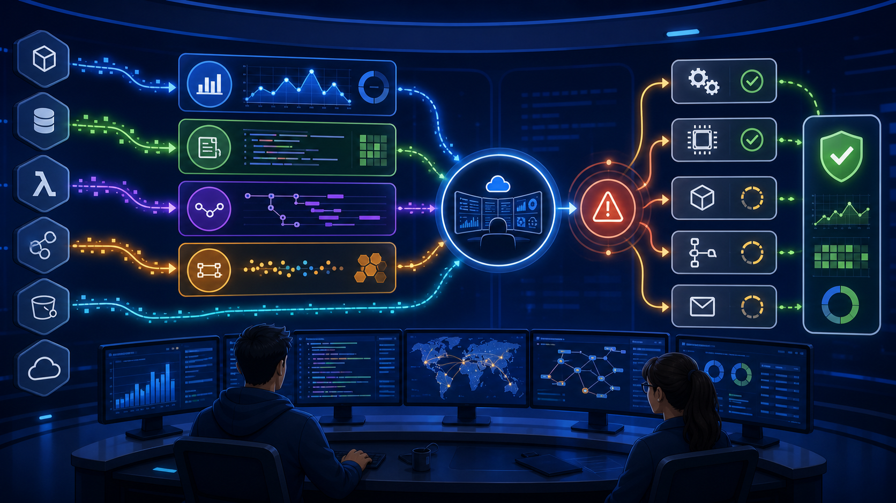
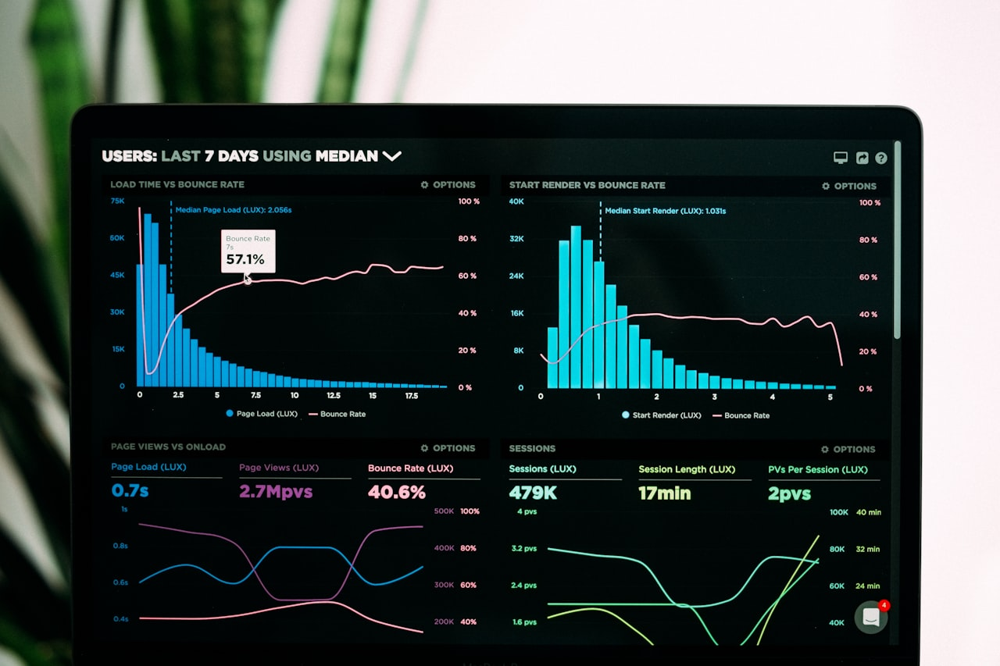

  

    
    
  

  

    <h1 class="title-main">Cloud AWS y despliegues productivos</h1>
    

    
Módulo 3 · Sesión 4

    <strong>Diego Fernando Baes Vasquez</strong>
  

---

  

    
    
  

  <h1>Docente</h1>
  

    

      
      <h3>Diego Fernando Baes Vasquez</h3>
      
Especialista Full Stack Senior

      
Backend, arquitectura cloud, microservicios y despliegues productivos sobre AWS.

    

    

      <h3>Acerca de mí</h3>
      <ul>
        <li>Ingeniería de Sistemas e Informática.</li>
        <li>Maestría en Ingeniería de Software en curso.</li>
        <li>Certificación AWS Developer Associate y Scrum Master.</li>
      </ul>
      <h3>Experiencia</h3>
      <ul>
        <li>Más de 7 años construyendo APIs, microservicios y plataformas cloud.</li>
        <li>Experiencia en Java Spring Boot, Node.js, Docker, serverless y contenedores.</li>
        <li>Proyectos en banca, seguros y gobierno con foco en alta disponibilidad.</li>
      </ul>
    

  

---

  

    
    
  

  <h1>Cómo vamos a aprender</h1>
  

    

      <strong>Entender</strong>
      Traducir cloud a problemas cotidianos: servidores, archivos, bases de datos, seguridad y costos.
    

    

      <strong>Practicar</strong>
      Conectar servicios paso a paso sin asumir experiencia previa en infraestructura.
    

    

      <strong>Construir</strong>
      Preparar el camino para desplegar aplicaciones frontend y backend en AWS.
    

  

  
El objetivo no es memorizar servicios: es aprender a elegirlos con criterio.

---

  <h1 class="section-title">Plan de estudio Curso Cloud AWS y despliegues productivos</h1>
  

    

      
<strong>Módulo 1</strong>Introducción a AWS

      
&gt;&gt;&gt;

      
Conceptos base, cuenta AWS, seguridad inicial, automatización y optimización

    

    

      
<strong>Módulo 2</strong>Dominio y almacenamiento

      
&gt;&gt;&gt;

      
Route 53, certificados SSL, S3 y CloudFront

    

    

      
<strong>Módulo 3</strong>Despliegue de aplicaciones

      
&gt;&gt;&gt;

      

        Sesión 1 - Despliegue de frontend en AWS 
        Sesión 2 - Backend con Elastic Beanstalk 
        Sesión 3 - Bases de datos con RDS 
        Sesión 4 - Monitoreo y eventos
      

    

    

      
<strong>Módulo 4</strong>Orquestación y escalabilidad

      
&gt;&gt;&gt;

      
Contenedores, balanceo, CI/CD y alta disponibilidad

    

  

---

  <h1 class="section-title">Módulo 3 - Despliegue de aplicaciones</h1>
  

    
<strong>Sesión 1</strong>Frontend

    
&gt;&gt;&gt;

    
Amplify, S3, CloudFront, dominio y entrega continua

  

  

    
<strong>Sesión 2</strong>Backend

    
&gt;&gt;&gt;

    
Elastic Beanstalk, plataformas, entornos, escalabilidad y monitoreo

  

  

    
<strong>Sesión 3</strong>Datos

    
&gt;&gt;&gt;

    
RDS, MySQL/PostgreSQL, backups, seguridad y conexión backend

  

  

    

      <strong>Sesión 4</strong>
      Monitoreo y eventos
    

    

      CloudWatch metrics y logs 
      Alarmas operativas 
      AWS X-Ray para trazabilidad 
      EventBridge para respuestas ante eventos
    

  

---

  <h1>Objetivos de aprendizaje</h1>
  

    

1

<strong>Distinguir métricas, logs y trazas</strong>Qué responde cada tipo de señal.

    

2

<strong>Crear alarmas útiles</strong>Detectar problemas antes de que los reporte el usuario.

    

3

<strong>Entender X-Ray</strong>Seguir una solicitud entre servicios.

    

4

<strong>Automatizar respuestas ante eventos</strong>Usar EventBridge para reaccionar con reglas.

  

---

  
  
Operar es ver, entender y reaccionar

---

  <h1>Observabilidad en una frase</h1>
  

    

      
Saber qué pasa

      
Observabilidad permite diagnosticar comportamiento real de sistemas usando señales generadas por la aplicación e infraestructura.

    

    

      
<strong>Métricas</strong>Números en el tiempo.

      
<strong>Logs</strong>Eventos escritos por servicios.

      
<strong>Trazas</strong>Ruta de una solicitud.

    

  

---

  <h1>CloudWatch</h1>
  

    

      
      
Las métricas convierten comportamiento real en señales accionables.

    

    

      

1

<strong>Metrics</strong>CPU, errores, latencia, requests y más.

      

2

<strong>Logs</strong>Registros de aplicación e infraestructura.

      

3

<strong>Alarms</strong>Alertas cuando una métrica cruza un umbral.

    

  

---

  

    <h1>Si una app está lenta, ¿qué mirarías primero: métricas, logs o trazas?</h1>
  

---

  <h1>Métricas: síntomas medibles</h1>
  

    
<strong>CPU</strong>Puede indicar saturación de cómputo.

    
<strong>Memory</strong>Requiere agente o servicio que la emita.

    
<strong>Latency</strong>Tiempo de respuesta percibido.

    
<strong>Errors</strong>Fallos 4xx, 5xx o excepciones.

    
<strong>Connections</strong>Útil en base de datos y balanceadores.

    
<strong>Storage</strong>Alerta antes de quedarse sin espacio.

  

---

  <h1>Logs: historia de lo que pasó</h1>
  

    

      
Los logs muestran eventos, errores y contexto generado por la aplicación o servicio.

      
Un buen log debe ayudar a responder qué ocurrió, cuándo, dónde y con qué contexto.

    

    

      ejemplo
<pre><code>{
  "level": "error",
  "route": "/orders",
  "status": 500
}</code></pre>
    

  

---

  <h1>Alarmas</h1>
  

    

      
Una alarma evalúa una métrica contra una condición durante un periodo.

      
Una alarma útil evita ruido y apunta a una acción clara.

    

    

      <h3>Archivo de apoyo</h3>
      
<code>04-cloudwatch-alarm-cli.sh</code>

      <ul>
        <li>Alarma de CPU.</li>
        <li>Umbral sostenido.</li>
        <li>Acción hacia SNS.</li>
      </ul>
    

  

---

  <h1>X-Ray: seguir una solicitud</h1>
  

    

      
AWS X-Ray ayuda a analizar solicitudes mientras atraviesan servicios, dependencias y bases de datos.

      
Cuando una API lenta tiene muchas piezas, una traza ayuda a encontrar dónde se pierde tiempo.

    

    

      
<strong>API</strong>

      
&gt;

      
<strong>Trace</strong>

      
&gt;

      
<strong>DB</strong>

    

  

---

  <h1>EventBridge: reaccionar a eventos</h1>
  

    
<strong>Event bus</strong>Canal donde llegan eventos.

    
<strong>Rule</strong>Filtra eventos que importan.

    
<strong>Target</strong>Servicio que ejecuta una acción.

  

  
Evento no es solo error: también puede ser despliegue, cambio de estado o tarea programada.

---

  <h1>Automatización de respuestas</h1>
  

    

1

<strong>Señal</strong>Métrica, log, evento o cambio de estado.

    

2

<strong>Regla</strong>Condición que decide si algo importa.

    

3

<strong>Acción</strong>Notificar, ejecutar función o abrir flujo operativo.

    

4

<strong>Revisión</strong>Confirmar que la respuesta ayudó y no generó ruido.

  

---

  <h1>Flujo práctico de la sesión</h1>
  

    

1

<strong>Revisar métricas</strong>Beanstalk, EC2 o RDS según recursos disponibles.

    

2

<strong>Consultar logs</strong>Buscar errores y contexto de aplicación.

    

3

<strong>Crear alarma</strong>Umbral simple con acción de notificación.

    

4

<strong>Diseñar evento</strong>Plantear una respuesta automática ante un cambio.

  

---

  <h1>Errores comunes</h1>
  

    
<strong>No mirar logs</strong>Se cambia infraestructura cuando el error era aplicación.

    
<strong>Alarmas ruidosas</strong>Demasiadas alertas hacen que nadie las atienda.

    
<strong>Sin contexto</strong>Logs sin request id o ruta complican diagnóstico.

    
<strong>Confundir síntoma y causa</strong>CPU alta puede ser consecuencia, no raíz.

    
<strong>No probar eventos</strong>La automatización falla justo cuando se necesita.

    
<strong>Guardar logs sin retención</strong>El costo crece sin control.

  

---

  <h1>Buenas prácticas</h1>
  

    
<strong>Definir señales clave antes de tener incidentes.</strong>

    
<strong>Crear alarmas con acción clara y poco ruido.</strong>

    
<strong>Usar logs estructurados cuando sea posible.</strong>

    
<strong>Agregar trazas cuando hay múltiples servicios involucrados.</strong>

    
<strong>Automatizar respuestas simples, medibles y reversibles.</strong>

  

---

  <h1>Resumen de la sesión</h1>
  

    
<strong>CloudWatch centraliza métricas, logs y alarmas para operación diaria.</strong>

    
<strong>Las métricas muestran síntomas; los logs aportan contexto; las trazas muestran recorrido.</strong>

    
<strong>X-Ray ayuda a diagnosticar solicitudes distribuidas.</strong>

    
<strong>EventBridge permite reaccionar a eventos con reglas y objetivos.</strong>

    
<strong>El módulo 3 deja una aplicación desplegada, conectada a datos y lista para observarse.</strong>

  

